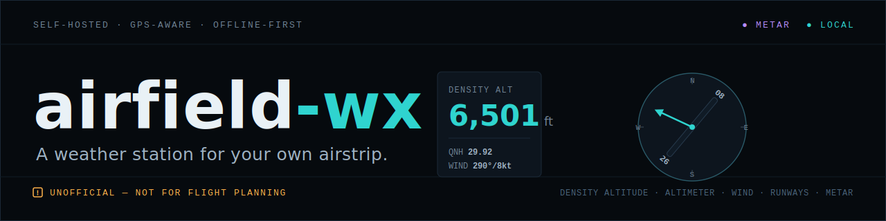
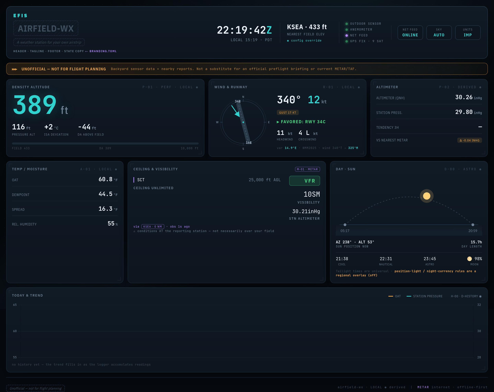
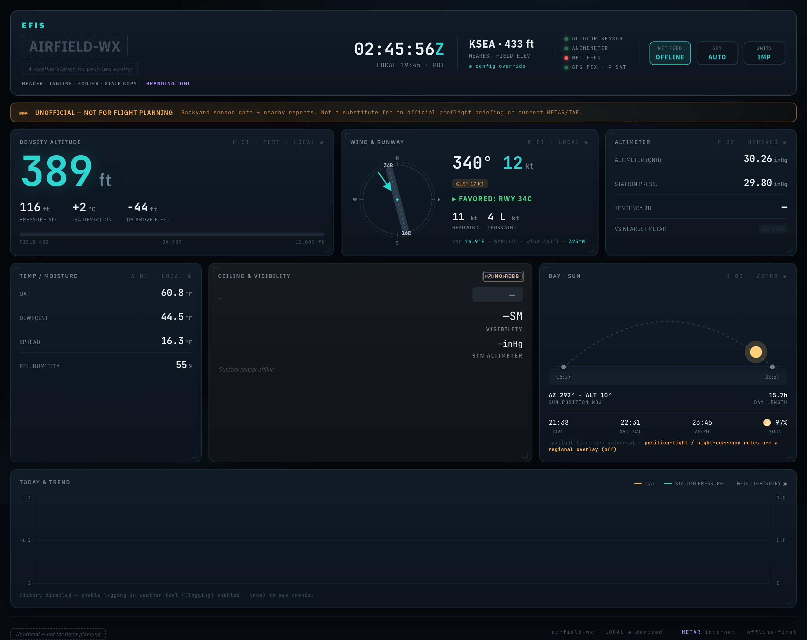

# airfield-wx

A self-hosted weather station for **your own airstrip**: build a small sensor, run a little server on
your home network, and get a cockpit-style readout of the conditions at *your* field — density
altitude, wind and the favored runway, altimeter setting, and (when you have internet) the nearest
METAR.

> ## ⚠ UNOFFICIAL — NOT FOR FLIGHT PLANNING
> airfield-wx is backyard sensor data plus nearby public reports. It is **not** a substitute for an
> official preflight briefing or current METAR/TAF, and it performs **no go/no-go automation**. You are
> the pilot in command. Observations only — no forecasting.

## Is this for you?

If you fly out of — or just love — a strip that has no weather station of its own, this gives you a
live picture of the air over your field:

- **Density altitude**, the number that decides how your airplane will actually perform today.
- **Your own wind**, turned into a **runway solution** — which end is favored, and the headwind and
  crosswind on it.
- **Altimeter setting (QNH)** and temperature/dewpoint, measured at your field.
- The **nearest airport, its runways, and magnetic variation**, found automatically from GPS — no typing
  in coordinates, and it works with no internet.

You don't need to be a programmer. There's a **demo you can try in five minutes** (below) before you buy
a single part. New to the terminal or to any of the aviation terms? The
[install guide](docs/guide/install.md) walks you through it gently, and the
[glossary](docs/guide/glossary.md) explains every term in plain language.

## What it looks like

### ▶ Try the live demo — **[airfield-wx-demo.vercel.app](https://airfield-wx-demo.vercel.app)**

Click through the dashboard in your browser, no setup required. It's **simulated data for a fictional
field** ("DEMO / Example Field") — nothing live or measured — with a scenario switcher for a clear (VFR)
day, a marginal (MVFR) day, and the feed-offline state. Like the product, it's **UNOFFICIAL — not for
flight planning.**



*The dashboard reads like a panel instrument. Cyan numbers are measured at your field; violet is
internet-sourced (the METAR). [Full dashboard tour →](docs/guide/dashboard.md)*

## What you'll need

| | |
|---|---|
| **A small sensor** | An **ESP32** board + a **BME280** (temp/humidity/pressure) + a **GPS** module + an **anemometer** (wind). Wires onto a perfboard; no soldering wizardry required. |
| **A computer to run the server** | A **Raspberry Pi Zero 2 W** is plenty — or any Ubuntu/Debian box, or even your laptop to start. It lives on your home network; no cloud, no accounts. |
| **Rough cost** | About **$100–250** of parts, mostly depending on the anemometer (a budget SparkFun kit vs. a rugged Davis 6410). |
| **Rough effort** | An afternoon to wire and flash the sensor; the server is a handful of copy-paste commands. |

Full parts list, wiring, pinout, and the one calibration step are in the
**[hardware & build guide](docs/guide/hardware.md)**.

## Try it in 5 minutes (no hardware)

```bash
git clone https://github.com/kbennett2000/airfield-wx.git
cd airfield-wx
make install        # creates the server's environment and installs it
make dev            # starts the server in demo mode on port 8005
```

Then open **<http://localhost:8005/dashboard/>**. It comes up with realistic sample data so you can
explore the whole instrument before any sensor exists. When you're ready for real readings, edit
`server/weather.toml` (comment out the `[development]` block and set your sensor's address) — the
**[install & configuration guide](docs/guide/install.md)** walks through every step, terminal and all.

(For a permanent, runs-at-boot install with a systemd service + firewall: `sudo ./install.sh` — see the
install guide.)

## Why it keeps working when the internet doesn't



Your field's own readings never depend on a network. If the internet feed drops, **only the violet
(internet-sourced) METAR panel dims** — every **cyan** local panel (density altitude, altimeter, wind,
the runway solution) **stays bright and keeps updating**. That asymmetry is deliberate, and it's the
heart of the design.

## Architecture (in brief)

For the technically inclined:

- **One source of truth:** a read-only, versioned HTTP API under `/api/v1/`. Every client (dashboard,
  tray widget) polls the same endpoints — no per-client math.
- **The database stores RAW sensor readings only;** every conversion / derived value (density altitude,
  altimeter setting, vane-corrected wind, runway components) is computed at **read time**. Bug fixes
  apply retroactively to all history — no backfill.
- **Offline-first:** the server starts, serves, and logs with no internet. The only thing that differs
  online vs offline is the optional `external` (METAR/model) block.
- **Provenance is visible:** **cyan** = your LOCAL sensors (always live); **violet** = internet-sourced
  (may be absent, and *dims* when the feed is gone). See the
  **[dashboard tour](docs/guide/dashboard.md)**.

The outdoor suite is **BME280 + GPS + anemometer** (no light sensor — sky/cloud come from METAR). The
anemometer can mount three ways (all-in-one, a remote anemometer on a cable, or an opt-in separate wind
station); a config knob selects the source and a freshness guard nulls stale wind so a dead sensor never
reads as current. Details and the trade-offs are in the [hardware guide](docs/guide/hardware.md) and
[ADR-0006](docs/adr/0006-flexible-anemometer-topology.md).

## Documentation

- **[Hardware & build](docs/guide/hardware.md)** — parts, ESP32 pinout, wiring, flashing, vane
  calibration, siting, the three mounting topologies.
- **[Install & configuration](docs/guide/install.md)** — a gentle terminal on-ramp, the demo path, the
  systemd service, and every `weather.toml` setting.
- **[Dashboard tour](docs/guide/dashboard.md)** — how to read the instrument, panel by panel.
- **[Verification checklist](docs/guide/verification.md)** — how to know it's working, end to end.
- **[Glossary](docs/guide/glossary.md)** — every aviation and computing term, in plain language.
- **[Future work](docs/future-work.md)** — what's deliberately deferred, and why.
- **[Design docs](docs/design/)** and **[architecture decisions](docs/adr/)** — the *why* behind the
  build (offline-first, local-first wind, the unofficial stance).

## Licensing & attribution

- **airfield-wx is MIT-licensed.** It is built on a copy of `weather-station-public` (MIT, same
  author) — an aviation variant, not a fork.
- **Airport / runway data:** [OurAirports](https://ourairports.com/data/) — public domain.
- **Magnetic variation:** the WMM2025 model via [`pygeomag`](https://pypi.org/project/pygeomag/) (MIT);
  the WMM coefficients are public domain (NOAA/NCEI + BGS).
- **METAR:** [aviationweather.gov](https://aviationweather.gov/) (FAA/NWS), keyless.

Self-hosted, LAN-only, no accounts, no cloud, no ads.
